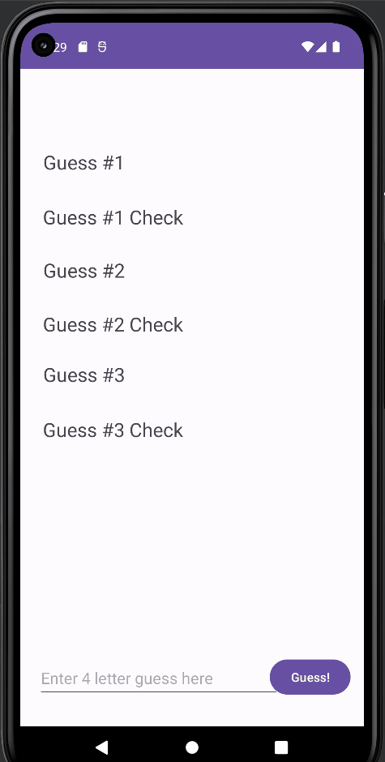

# Android Project 1 - *Wordle*

Submitted by: **Siraj Mughal**

**Wordle** is an android app that recreates a simple version of the popular word game [Wordle](https://www.nytimes.com/games/wordle/index.html). 

Time spent: **2** hours spent in total

## Required Features

The following functionality is completed:

- [✅] **User has 3 chances to guess a random 4 letter word**
- [✅] **After 3 guesses, user should no longer be able to submit another guess**
- [✅] **After each guess, user sees the "correctness" of the guess**
- [✅] **After all guesses are taken, user can see the target word displayed**

## Video Walkthrough

Here's a walkthrough of implemented user stories:

GIF created with ScreentoGif

To display the 'correctness' of a guess:
'O' represents the right letter in the right place
'+' represents the right letter in the wrong place
'X' represents a letter not in the target word
For example, if the target word is "STAR", and the user guessed 'SAIL', the string generated would be "O+XX".

